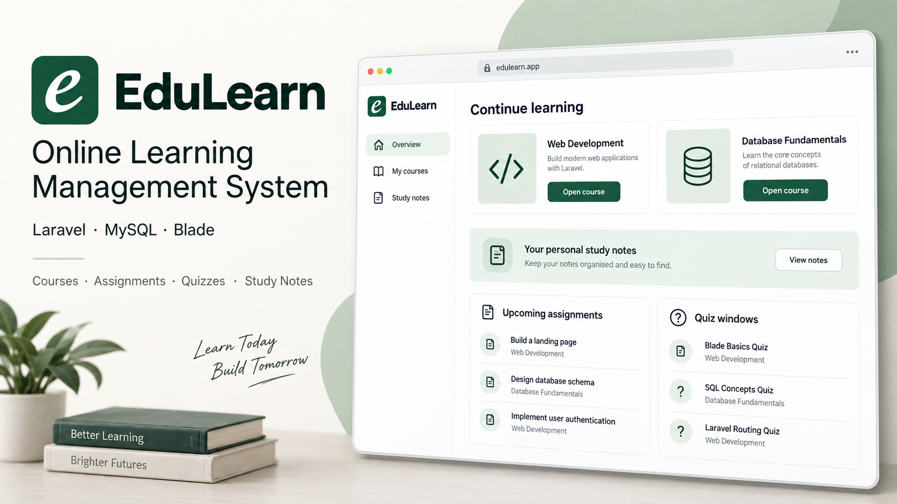

# EduLearn



A fully online LMS under active implementation with Laravel 13.31, PHP 8.3, MySQL, Blade and private file storage. The source contains course learning, assignments, timed multiple-choice quizzes and private study notes, with administrator-managed accounts and learner self-enrollment. No active university ERP workflow is part of the product.

See the [requirements checklist and milestone plan](docs/requirements-status.md), [scope conversion audit](docs/online-lms-audit.md), and [validation record](docs/validation.md). These distinguish implemented behavior from incomplete SRS requirements. This is not a production-readiness claim.

## Local setup

Use PHP 8.3+ with the extensions required by Composer, plus `pdo_mysql` for MySQL and `zip`/`dom` for office-document extraction. Verify the web-server PHP configuration as well as the CLI configuration. The web process needs write access to `storage/` and `bootstrap/cache/`; keep private uploads outside the public web root.

Use the existing Valet site at **https://lms.test**. Do not run `php artisan serve`. For a new installation, copy `.env.example` to `.env`, configure MySQL and run:

```sh
composer install
php artisan config:clear
php artisan lms:prepare
php artisan migrate --no-interaction
php artisan db:seed --no-interaction
```

`composer setup` runs the same preparation and migration steps without demo seeding. `lms:prepare` enforces MySQL, preserves an existing application key, and refuses to generate a new key for a database containing users. Seed only a fresh local/test installation.

Preserve an existing `.env`, application key, database and private storage. The previous scope-conversion migration removes obsolete tables and is forward-only: back up the database and matching source first and follow the retention plan in the audit. Do not use `migrate:fresh` against the application database.

The current frontend uses local CSS/JavaScript and Blade. No npm manifest or asset compilation dependency is required; the SRS permits retaining this stack. Run `php artisan view:cache` for Blade compilation.

## Development accounts

| Role | Email | Initial development password |
| --- | --- | --- |
| Administrator | admin@acumen.test | Learning-demo-2026! |
| Instructor | instructor@acumen.test | Learning-demo-2026! |
| Learner | student@acumen.test | Learning-demo-2026! |

Existing email identifiers/passwords are preserved through rebranding. Seeders are local/testing-only and never appropriate for production. They retain account passwords but refresh demonstration roles and reader files. Public signup is disabled. Administrators provision accounts and manage course access. Following the updated product decision, active learners can enroll in published courses from the catalog. Repeated enrollment requests are idempotent. Explicit administrator removals require administrator reinstatement. Share initial credentials through an approved secure channel; they are never written to activity logs.

## Accounts and sessions

Five failed logins within the configured failure window lock the normalized email identifier across IP addresses. The default lock is 15 minutes from the fifth failure, configured by `LMS_LOGIN_LOCKOUT_MINUTES`; successful login clears failures. Separate IP throttling limits all authentication requests. Generic failures avoid exposing whether an account is inactive.

Login regenerates the session and redirects by role. Logout invalidates it. Account deactivation, role/email changes and password changes revoke old sessions through an authentication version and rotated remember token. Reactivation requires a fresh login. Profile/password changes require the current password. Administrators cannot deactivate or demote themselves. Account and course evidence are retained.

## Queue, scheduler and email

```sh
php artisan queue:work database --sleep=1 --tries=3 --timeout=45
php artisan schedule:work
```

Use supervised worker processes and a once-per-minute `php artisan schedule:run` host task in deployment. The code's schedule declaration does not install a host scheduler. The quiz finalizer processes up to 500 expired attempts per run and can also be run with `php artisan quizzes:finalize`.

Password-reset flow uses Laravel's email broker. `.env.example` uses local log mail; configure and verify real SMTP before claiming email delivery. Keep queue retry timing greater than the worker timeout. Serve only `public/`, with private uploads outside the web root.

## AI configuration

Configure AI through **AI administration**. Pull OpenRouter free models, select one, enter the provider credential and save. Pulling the catalogue selects the corresponding provider in the form but does not change the saved configuration until you save. Credentials are encrypted with this installation's `APP_KEY`. `AI_PROVIDER=mock` produces explicitly labelled development output, not real AI.

Saved database settings take precedence over environment defaults. For an installation without saved settings, OpenRouter uses `OPENROUTER_API_KEY` and `OPENROUTER_MODEL`; OpenAI uses `OPENAI_API_KEY` and `OPENAI_MODEL`. Keep credentials server-side. Notes need the queue worker above. Tests fake inference; a successful credential test is not an inference test. See [AI setup and troubleshooting](docs/ai-providers.md).

## Verification

Create a dedicated MySQL test database (default `acumen_university_test`) and grant the configured test user access to it. The test harness requires MySQL and a database name ending in `_test`, and checks this before `RefreshDatabase` can reset any tables. Never use application data for tests.

```sh
# MySQL run. Clear the config cache FIRST: a cached config ignores DB_DATABASE and the
# suite would run migrate:fresh against the application database.
php artisan config:clear
DB_CONNECTION=mysql DB_DATABASE=acumen_university_test vendor/bin/phpunit

vendor/bin/phpunit                 # portable SQLite run
vendor/bin/pint --format agent
composer validate --no-check-publish
php artisan view:cache --no-interaction
php artisan route:list --except-vendor
```

Portable tests use isolated SQLite; the delivered application uses MySQL. MySQL integration tests require a dedicated test database. The destructive upgrade fixture explicitly permits only `acumen_university_test` on MySQL; that retained test database name has no relationship to the active product scope.

`tests/TestCase.php` refuses to run if the connection resolves to `acumen_lms`, and reports how to fix it. `RefreshDatabase` runs `migrate:fresh`, so without that guard a stale `bootstrap/cache/config.php` silently destroys application data — this has happened.

## Important remaining work

Materials accept PDF/DOCX/PPTX/TXT/Markdown up to 10 MB with private storage and uploader metadata, and support replacement with retained revisions plus archival. AI study notes now extract text from TXT, Markdown, DOCX, PPTX and text-based PDF; scanned PDFs are reported as needing OCR, which is **not** implemented. Short-answer quizzes, explicit result publication and AI administration are delivered.

Still missing: assignment draft/publication and attachments, assignment notifications, configurable quiz attempt limits, configurable grading/rounding policy, result summaries and reports, and instructor AI quiz-question generation. See `docs/requirements-status.md` for the full outstanding list before treating any workflow as SRS-compliant.

Production prerequisites include real mail, HTTPS/secure cookies, debug disabled, worker/scheduler supervision, private storage backups with restoration tests, monitoring, load measurement and a security/accessibility review. No deployment, 99% availability, WCAG conformance or concurrency target is claimed.

Valet serves this site through a front controller outside the application, so `public/.user.ini` is **not** honoured; the limits live in the site's nginx server block as `fastcgi_param PHP_VALUE` plus `client_max_body_size`. DOCX/PPTX validation requires the PHP zip and DOM extensions. Historical uploader/size backfill remains pending.

## AI providers

The model field is a dropdown populated by pulling each provider's catalogue on demand
(OpenRouter's public zero-price list; OpenAI's model list, which needs a saved credential first).
A withdrawn model is rejected on save rather than silently replaced, and a paid model is never
reachable.

**Zero data retention defaults to on.** Free-model availability under this restriction varies. The application never relaxes the saved privacy policy automatically. See `docs/ai-providers.md` for the verified working configuration and for how
failures are classified in the admin activity log.

## Video lectures

Course video lectures are uploaded, stored privately and streamed through authorized routes with HTTP Range support. **MP4 with H.264 video and AAC audio only**; the container is validated by parsing its box tree in PHP, so FFmpeg/ffprobe is not required and is not used. There is no transcoding, no automatic thumbnailing and no speech-to-text — posters and transcripts are uploaded by staff.

The video size limit (`VIDEO_MAX_KILOBYTES`, default 500 MB) is **separate from and does not raise** the 10 MB study-material limit. PHP and web-server limits must be raised for this site only; see `docs/video-operations.md`, which also covers private delivery, the optional `X-Accel-Redirect` path, progress/completion rules and what is deliberately not implemented.

## Moving to Windows or another device

Git transfers code, not `.env`, database contents, private uploads or background workers. For an existing installation, transfer the database and `storage/app/private` securely, preserving its `APP_KEY`; do not generate a new key against a copied database. Alternatively, enter a new provider credential through AI administration if only that encrypted credential needs replacing. Use a separate key for a genuinely new installation.

After configuring MySQL and installing Composer dependencies, run:

```sh
php artisan optimize:clear
php artisan migrate --no-interaction
php artisan queue:restart
php artisan queue:work database --sleep=1 --tries=3 --timeout=45
```

Keep the last process running in its own terminal or a service. Run the scheduler separately. Do not reseed or use `migrate:fresh` on an existing database. Point Apache/Nginx at `public/`; continue using Valet at `https://lms.test` on this development machine, never `php artisan serve`.

On Windows, check the PHP configuration actually loaded by Apache/FastCGI, not only the CLI's `php --ini`. Enable the required PHP extensions, configure a trusted CA bundle for cURL/OpenSSL when the Windows PHP distribution needs one, and restart both the web server and queue worker after configuration changes. Never disable TLS verification. Outbound HTTPS to `openrouter.ai` must be allowed.

Video upload ceilings are server settings and do not travel with Git. Follow [video operations](docs/video-operations.md) to configure PHP and web-server limits. Staff upload forms display the PHP/application ceiling from the running web process. Existing recordings also require their private files to be copied; database records alone cannot play a video.

Frontend upload and model-selector regression tests need no npm installation: `node --test tests/upload-ui.test.cjs`.
