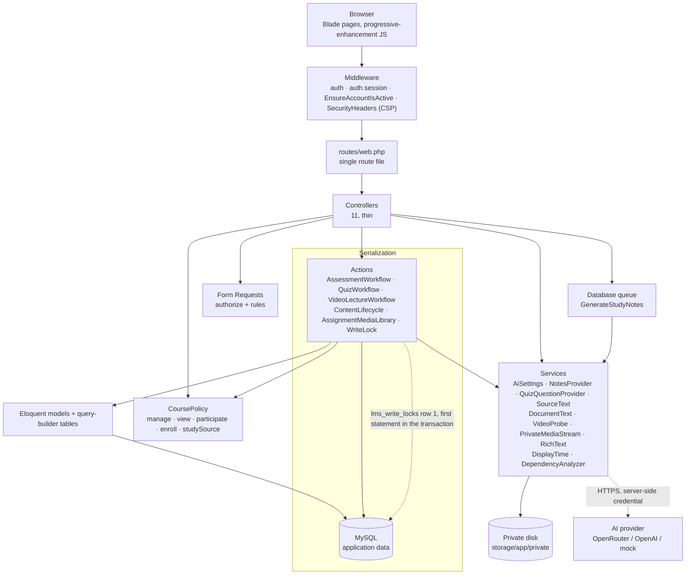

# A. System architecture

Request path through the application. Blade renders every page; there is no client-side router,
no API consumed by a frontend, and no build step.

Notes that are easy to miss:

- Every multi-step mutation takes the shared write lock before reading anything, then re-checks
  authorization against freshly loaded state inside the same transaction.
- Private files never have a public URL. Bytes leave only through an authorized route, and video
  goes through `PrivateMediaStream` so Range requests work without buffering the file.
- The AI provider is reached only from the server, with the credential encrypted at rest.
