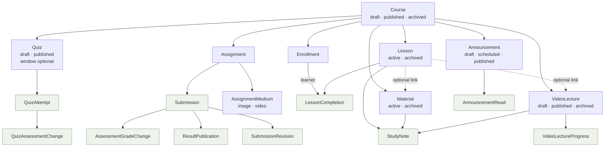

# B. Course and learning flow

Derived from the actual schema; every arrow is a real foreign key.

Shaded nodes are learner history. Each one is a `RESTRICT` reference, which is what makes the
parent undeletable while it exists.
