# E. Entity relationship diagram

Generated from the live schema (31 application tables, 62 foreign keys). Framework tables
(`migrations`, `cache*`, `jobs*`, `failed_jobs`, `sessions`, `password_reset_tokens`) are omitted:
they hold no application data.

Keys and state-carrying columns only; the full column list is the schema itself. Each relationship
is labelled with the database's own `ON DELETE` action, because that action is what ultimately
decides whether a record can be destroyed.

```mermaid
erDiagram
  account_activity {
    bigint id PK
    bigint user_id FK
    bigint actor_id FK
  }
  ai_configurations {
    bigint id PK
    int version
  }
  ai_usage_events {
    bigint id PK
    varchar status
  }
  announcement_reads {
    bigint announcement_id FK
    bigint user_id FK
  }
  announcements {
    bigint id PK
    bigint course_id FK
    bigint author_id FK
    timestamp published_at
  }
  assessment_grade_changes {
    bigint id PK
    bigint submission_id FK
    bigint actor_id FK
  }
  assignment_extensions {
    bigint id PK
    bigint assignment_id FK
    bigint user_id FK
    bigint actor_id FK
    datetime due_at
  }
  assignment_media {
    bigint id PK
    bigint assignment_id FK
    varchar kind
    bigint uploader_id FK
  }
  assignments {
    bigint id PK
    bigint course_id FK
    datetime due_at
    int version
  }
  course_access_changes {
    bigint id PK
    bigint course_id FK
    bigint user_id FK
    bigint actor_id FK
  }
  course_instructors {
    bigint id PK
    bigint course_id FK
    bigint user_id FK
  }
  courses {
    bigint id PK
    bigint instructor_id FK
    varchar status
    varchar code UK
  }
  enrollments {
    bigint id PK
    bigint course_id FK
    bigint user_id FK
  }
  lesson_completions {
    bigint id PK
    bigint lesson_id FK
    bigint user_id FK
  }
  lessons {
    bigint id PK
    bigint course_id FK
    varchar body_format
    varchar status
    timestamp archived_at
    bigint archived_by FK
    int version
  }
  lms_write_locks {
    tinyint id PK
  }
  material_revisions {
    bigint id PK
    bigint material_id FK
    int version
    bigint uploader_id FK
    bigint replaced_by FK
  }
  materials {
    bigint id PK
    bigint course_id FK
    bigint lesson_id FK
    bigint uploader_id FK
    int version
    varchar status
    timestamp archived_at
    bigint archived_by FK
  }
  quiz_assessment_changes {
    bigint id PK
    bigint quiz_attempt_id FK
    bigint actor_id FK
    int version
  }
  quiz_attempts {
    bigint id PK
    bigint quiz_id FK
    bigint user_id FK
    datetime deadline_at
    int version
    datetime submitted_at
  }
  quizzes {
    bigint id PK
    bigint course_id FK
    datetime opens_at
    datetime closes_at
    varchar status
    int version
    bigint published_by FK
    timestamp published_at
  }
  result_publications {
    bigint id PK
    bigint submission_id FK
    bigint actor_id FK
  }
  settings {
    varchar key PK
  }
  study_notes {
    bigint id PK
    bigint user_id FK
    bigint course_id FK
    bigint lesson_id FK
    bigint material_id FK
    bigint video_lecture_id FK
    varchar status
  }
  submission_revisions {
    bigint id PK
    bigint submission_id FK
    int version
    timestamp submitted_at
  }
  submissions {
    bigint id PK
    bigint assignment_id FK
    bigint user_id FK
    datetime submitted_at
    varchar status
    bigint graded_by FK
  }
  users {
    bigint id PK
    varchar email UK
    varchar role
    tinyint is_active
  }
  video_lecture_progress {
    bigint id PK
    bigint video_lecture_id FK
    bigint user_id FK
  }
  video_lecture_revisions {
    bigint id PK
    bigint video_lecture_id FK
    int version
    bigint uploader_id FK
    bigint replaced_by FK
  }
  video_lecture_tracks {
    bigint id PK
    bigint video_lecture_id FK
    varchar kind
    int version
    bigint uploader_id FK
  }
  video_lectures {
    bigint id PK
    bigint course_id FK
    bigint lesson_id FK
    varchar status
    varchar processing_status
    bigint uploader_id FK
    timestamp published_at
    bigint published_by FK
    timestamp archived_at
    bigint archived_by FK
    int version
  }

  users ||--o{ account_activity : "RESTRICT"
  users ||--o{ account_activity : "RESTRICT"
  users ||--o{ announcement_reads : "RESTRICT"
  announcements ||--o{ announcement_reads : "RESTRICT"
  users ||--o{ announcements : "RESTRICT"
  courses ||--o{ announcements : "RESTRICT"
  users ||--o{ assessment_grade_changes : "NO ACTION"
  submissions ||--o{ assessment_grade_changes : "NO ACTION"
  users ||--o{ assignment_extensions : "NO ACTION"
  assignments ||--o{ assignment_extensions : "NO ACTION"
  users ||--o{ assignment_extensions : "NO ACTION"
  assignments ||--o{ assignment_media : "CASCADE"
  users ||--o{ assignment_media : "SET NULL"
  courses ||--o{ assignments : "RESTRICT"
  users ||--o{ course_access_changes : "RESTRICT"
  courses ||--o{ course_access_changes : "RESTRICT"
  users ||--o{ course_access_changes : "RESTRICT"
  courses ||--o{ course_instructors : "CASCADE"
  users ||--o{ course_instructors : "RESTRICT"
  users ||--o{ courses : "RESTRICT"
  courses ||--o{ enrollments : "RESTRICT"
  users ||--o{ enrollments : "RESTRICT"
  lessons ||--o{ lesson_completions : "RESTRICT"
  users ||--o{ lesson_completions : "RESTRICT"
  users ||--o{ lessons : "SET NULL"
  courses ||--o{ lessons : "RESTRICT"
  materials ||--o{ material_revisions : "RESTRICT"
  users ||--o{ material_revisions : "RESTRICT"
  users ||--o{ material_revisions : "RESTRICT"
  users ||--o{ materials : "RESTRICT"
  lessons ||--o{ materials : "RESTRICT"
  users ||--o{ materials : "RESTRICT"
  courses ||--o{ materials : "RESTRICT"
  users ||--o{ quiz_assessment_changes : "RESTRICT"
  quiz_attempts ||--o{ quiz_assessment_changes : "RESTRICT"
  quizzes ||--o{ quiz_attempts : "NO ACTION"
  users ||--o{ quiz_attempts : "NO ACTION"
  courses ||--o{ quizzes : "NO ACTION"
  users ||--o{ quizzes : "NO ACTION"
  users ||--o{ result_publications : "RESTRICT"
  submissions ||--o{ result_publications : "RESTRICT"
  courses ||--o{ study_notes : "RESTRICT"
  lessons ||--o{ study_notes : "RESTRICT"
  materials ||--o{ study_notes : "RESTRICT"
  users ||--o{ study_notes : "RESTRICT"
  video_lectures ||--o{ study_notes : "RESTRICT"
  submissions ||--o{ submission_revisions : "RESTRICT"
  assignments ||--o{ submissions : "RESTRICT"
  users ||--o{ submissions : "RESTRICT"
  users ||--o{ submissions : "RESTRICT"
  users ||--o{ video_lecture_progress : "CASCADE"
  video_lectures ||--o{ video_lecture_progress : "CASCADE"
  users ||--o{ video_lecture_revisions : "RESTRICT"
  users ||--o{ video_lecture_revisions : "RESTRICT"
  video_lectures ||--o{ video_lecture_revisions : "RESTRICT"
  users ||--o{ video_lecture_tracks : "RESTRICT"
  video_lectures ||--o{ video_lecture_tracks : "CASCADE"
  users ||--o{ video_lectures : "RESTRICT"
  courses ||--o{ video_lectures : "RESTRICT"
  lessons ||--o{ video_lectures : "SET NULL"
  users ||--o{ video_lectures : "RESTRICT"
  users ||--o{ video_lectures : "RESTRICT"

```

## Reading the delete rules

| Action | Meaning | Where it is used |
| --- | --- | --- |
| `RESTRICT` / `NO ACTION` | The parent cannot be deleted while the child exists | All learner history and all authored content |
| `SET NULL` | The child survives and forgets the parent | `video_lectures.lesson_id`, `lessons.archived_by`, uploader columns |
| `CASCADE` | The child is destroyed with the parent | Only `video_lecture_progress`, `video_lecture_tracks` and `assignment_media`, none of which is assessed work |

**Dangerous relationships, stated plainly.** `assignment_media` cascades from `assignments`: if an
assignment were ever deletable, its reference files would go with it. That is correct for an
illustration and would be wrong for a submission, which is why `submissions` restricts instead.
`video_lecture_progress` cascades from both the lecture and the user — viewing position is a
convenience, not a grade, and the design treats it as such. Nothing that records an assessment
outcome cascades anywhere.
