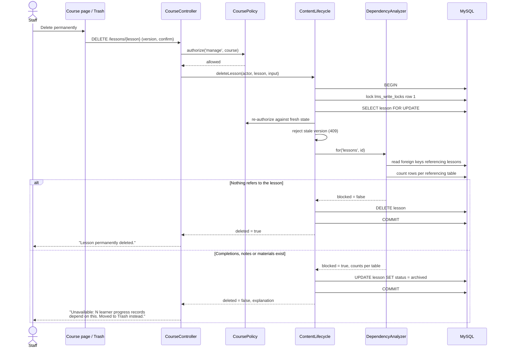

# C. Lesson deletion

The implemented path, not an idealised one.

The database constraints remain the final guard: if the analyser were ever wrong, `RESTRICT`
refuses the delete rather than orphaning a record. Constraints are never disabled.
