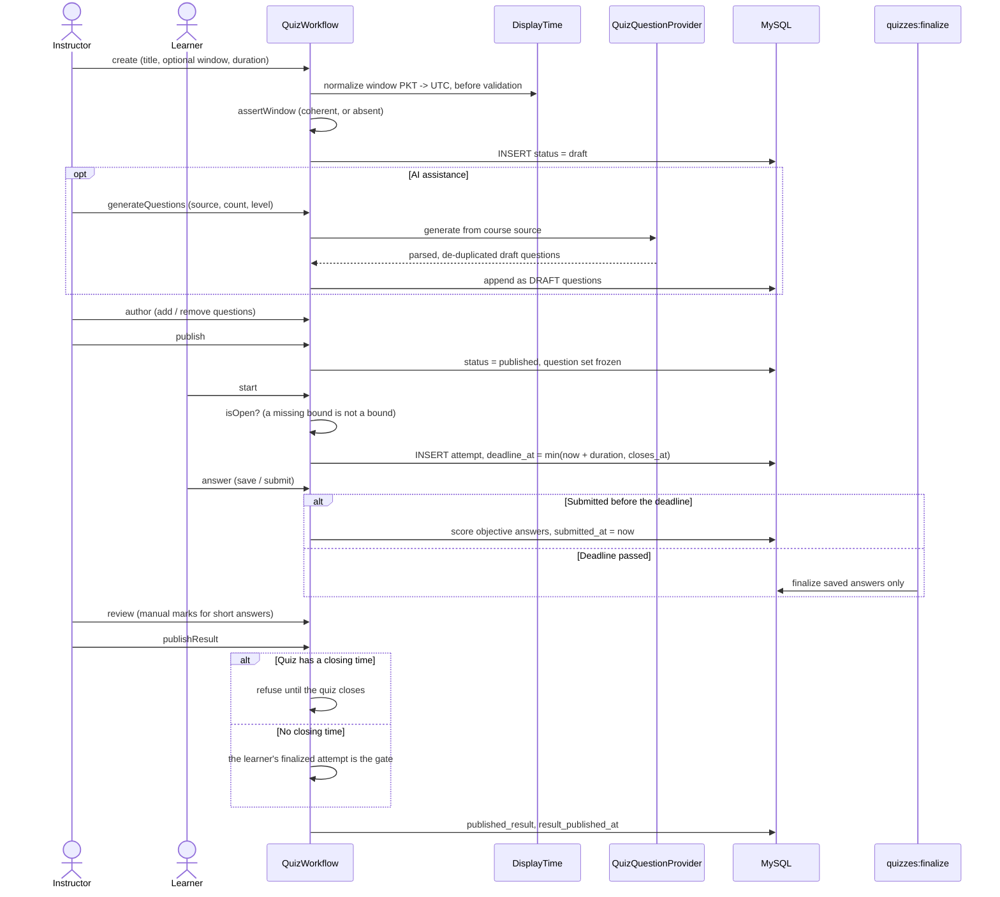

# D. Quiz lifecycle

Editing after publication changes the title, instructions and window only. Attempts keep the
`deadline_at` recorded when they began, so moving the window never alters time already promised.
